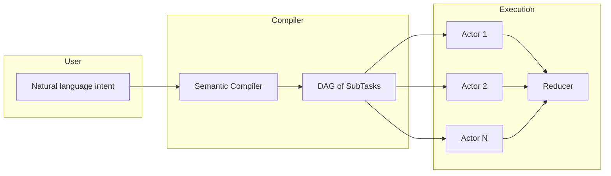
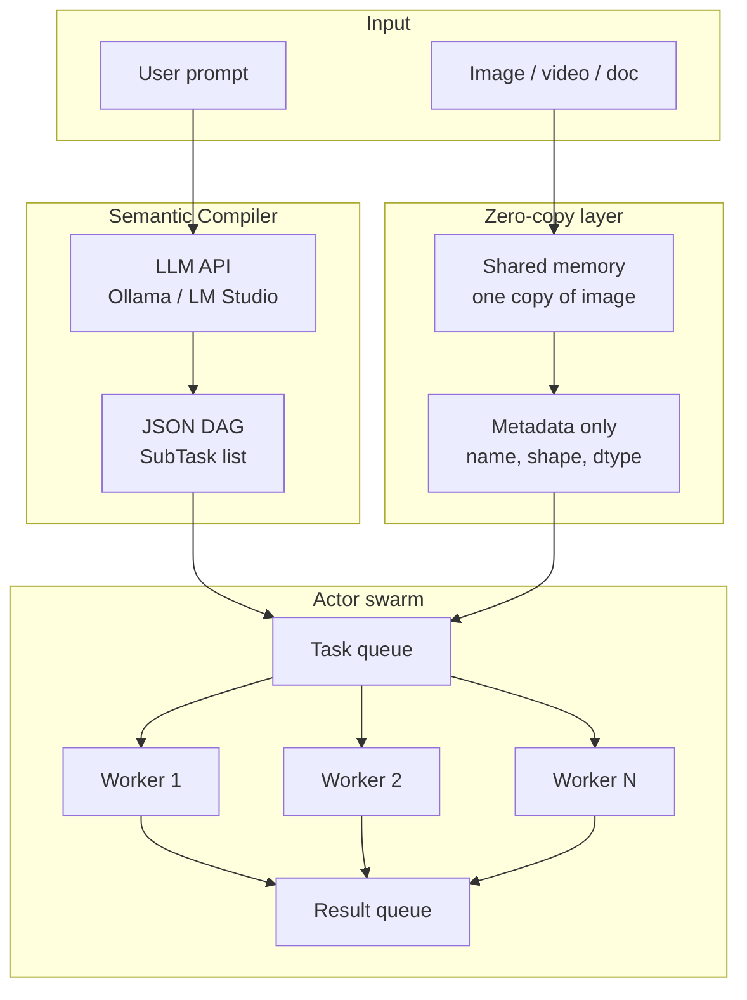
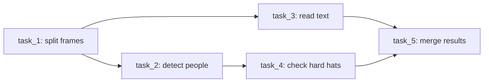
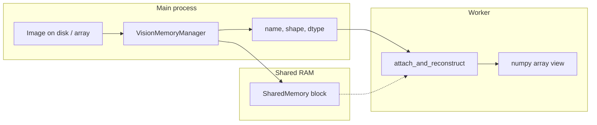
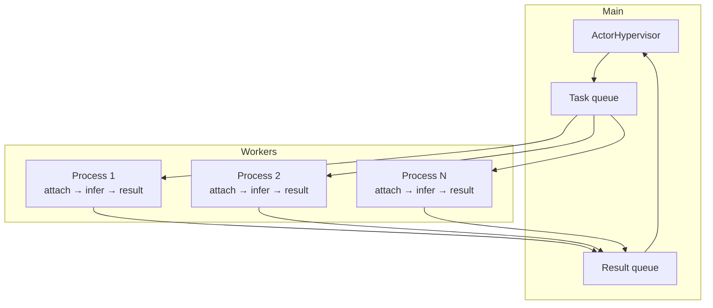

# ThreadSwarm

**Distributed Vision AI on CPUs** — Natural-language intent is compiled into a DAG of micro-tasks and executed by a swarm of small models on local CPUs, using zero-copy shared memory and the Actor model. No GPUs required.

---

## The idea

### Problem: the monolithic model trap

Today, complex vision tasks (analyze a video, extract data from a document, inspect an image) are usually handed to a single huge model. That leads to:

- **High cost** — Big models need expensive GPU clusters.
- **Slowness** — One model processes the whole input sequentially.
- **Waste** — Using a 70B model to read a date from an invoice is overkill.

### Solution: compile intent, then swarm

Instead of one oracle model, we split the job in two phases:

1. **Semantic Compiler** — A small, fast LLM (e.g. running locally) takes the user’s *intent* in natural language and outputs a **Directed Acyclic Graph (DAG)** of small, well-defined sub-tasks (e.g. “split video into frames”, “detect people in frame X”, “check if they wear hard hats”).
2. **Actor swarm** — Many small vision/language models run as **independent processes** on CPU cores. Each one gets a micro-task and a pointer to shared memory (e.g. one frame). They work in parallel and send back structured results; a reducer can merge them into a final answer.

So: **one compiler plans, many small models execute**. No single giant model; no need for GPUs if you have enough RAM and CPU cores.

### High-level flow



---

## Architecture overview



- **Compiler**: intent → DAG (no image data).
- **Shared memory**: image lives once in RAM; workers get only metadata and attach to the same buffer.
- **Workers**: each process takes a task + metadata, attaches to shared memory, runs inference, pushes a result.

---

## Current implementation

What exists today in this repo: the **core engine** (compiler + shared memory + actor pool). Model adapters (e.g. load SmolVLM and run inference inside workers) are left to you or future modules.

### 1. Semantic Compiler (`src/compiler/`)

- **Role**: Turn a user prompt into a strict **DAG of SubTasks** (no execution, only planning).
- **How**: Calls an OpenAI-compatible API (e.g. **Ollama** at `http://localhost:11434/v1`). Sends a system prompt that forces a JSON array of tasks; parses and validates with **Pydantic**.
- **Output**: `TaskDAG` — ordered list of `SubTask` with `id`, `description`, `instruction`, `dependencies`, optional `payload_hint`.

**Example DAG** (conceptually):



**Code**: `SemanticCompiler.compile(prompt)` → `TaskDAG`. Each `SubTask` has `instruction` and `dependencies` so a scheduler can run them in order or in parallel when deps are satisfied.

---

### 2. Zero-copy shared memory (`src/engine/shared_memory.py`)

- **Role**: Store the image (or tensor) **once** in RAM; workers receive only **metadata** and attach to the same block. No copying buffers between processes; no pickle for image data.
- **How**:
  - **VisionMemoryManager**: loads an image (path or numpy array, via OpenCV/numpy), allocates `multiprocessing.shared_memory.SharedMemory`, copies the array into it, returns a dict `{name, shape, dtype, size}`.
  - **attach_and_reconstruct(metadata)**: in each worker, given that dict, attaches to the same `SharedMemory` and builds a numpy array that **views** the buffer (zero-copy). The worker must keep the shared-memory handle until it is done with the array, then close it.

**Data flow**:



Only the small metadata dict goes over the task queue; the image stays in one place.

---

### 3. Actor swarm (`src/engine/actor_pool.py`)

- **Role**: Run **N worker processes** (default `os.cpu_count()`). Each worker pulls **tasks** from a queue, reconstructs the image from shared memory when the task has `image_metadata`, runs an **inference hook**, and pushes `{task_id, result, error}` to a result queue.
- **How**:
  - **ActorHypervisor**: creates one `multiprocessing.Queue` for tasks and one for results; spawns N processes running `_worker_loop`.
  - **Task payload**: dict with `task_id`, `instruction`, and optionally `image_metadata` (the dict from VisionMemoryManager). No raw image bytes on the queue.
  - **run_inference_hook(image, instruction, task_id)**: you provide a **picklable** function (e.g. module-level); the worker calls it with the reconstructed array (or None) and the instruction. Default is a stub that returns shape/info.
  - **Shutdown**: hypervisor sends a sentinel per worker, workers exit, then join. No threading for inference — only processes.

**Process layout**:



---

## End-to-end (idea vs current code)

| Step | Idea | Current implementation |
|------|------|-------------------------|
| 1. Intent → plan | Semantic Compiler produces DAG | `SemanticCompiler` calls local LLM API, parses JSON → `TaskDAG` (Pydantic) |
| 2. Image in RAM once | Zero-copy shared memory | `VisionMemoryManager.load_and_share()` + workers use `attach_and_reconstruct(metadata)` |
| 3. Run sub-tasks in parallel | Actor swarm on CPU cores | `ActorHypervisor` + N processes; task queue carries only metadata; `run_inference_hook` for real model (you plug it) |
| 4. Merge results | Reducer / aggregator | Not implemented yet; you consume `result_queue` and merge by `task_id` / DAG dependencies |

So: **compiler**, **shared memory**, and **actor pool** are implemented and wired; **scheduler** (which tasks to send when, respecting DAG) and **reducer** (merge results into one answer) are the next layer you can add on top.

---

## Repository structure

```
docs/rfcs/       — RFCs for architectural changes
src/compiler/    — Semantic Compiler (intent → DAG, LLM API, Pydantic)
src/engine/      — Shared memory manager, actor pool, worker loop
src/models/      — (Reserved) model adapters (e.g. load SmolVLM in workers)
tests/           — Tests for compiler and engine
```

---

## Constraints

- **No threading for AI inference** — use `multiprocessing` only (GIL).
- **No pickle / IPC for image tensors** — only shared memory + metadata on queues.
- **Windows**: `run_inference_hook` must be picklable (e.g. module-level function).

---

## Engineering & contribution guidelines

- Use **type hints** and **Pydantic** for public APIs and task schemas.
- Keep **src/compiler** for intent → DAG, **src/engine** for execution, **src/models** for model loaders.
- New architectural features: propose an **RFC** in `docs/rfcs/` first; code must follow the spec.
- Core engine: **no placeholders or mocks**; contributions should be production-ready.

---

## Requirements

- Python 3.10+
- See `requirements.txt` or `pyproject.toml` for dependencies (numpy, opencv-python-headless, pydantic, httpx; pytest for dev).

---

## License

Open source; see repository license file.
