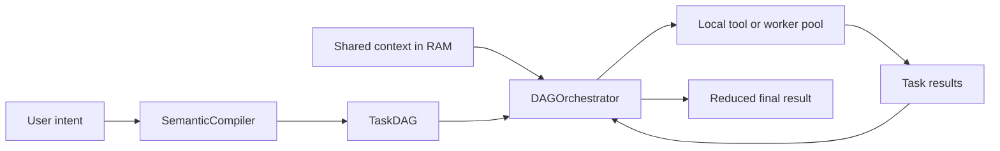

# ThreadSwarm

ThreadSwarm is a CPU-first runtime for breaking complex work into a DAG of small tasks that can run on almost any PC.

The key idea is simple:
- a semantic compiler turns a high-level request into a `TaskDAG`
- large shared context lives once in RAM
- each task is routed to a cheap local tool or, when needed, a specialized worker
- an orchestrator respects dependencies and reduces leaf results into a final output

This repo is aimed at practical portability, not GPU-heavy orchestration. The happy path is: use local tools first, use models only when they actually add value.

## Why

Complex tasks often get pushed into one giant model, which creates three problems:
- hardware cost
- latency
- wasted intelligence for work that could be done by simpler tools

ThreadSwarm takes the opposite approach: decompose work into tiny steps and run those steps with the cheapest executor that can do the job on CPU hardware.

## Architecture



The runtime is split into a few small pieces:
- `src/config.py`: typed runtime configuration for provider/model settings
- `src/cli.py`: command line entrypoint for validation, compilation, and demos
- `src/compiler/`: planning only
- `src/demos/`: packaged runnable demos and sample data
- `src/engine/shared_memory.py`: zero-copy context sharing for `ndarray`, `str`, and `bytes`
- `src/engine/actor_pool.py`: process-based execution pool
- `src/engine/orchestrator.py`: dependency-aware DAG execution
- `src/engine/tool_registry.py`: registration of local CPU-friendly tools

## Current Capabilities

What the repo can do today:
- validate DAGs with clear errors for duplicate IDs, missing dependencies, future dependencies, self-dependencies, and cycles
- store large context once in shared memory and reconstruct it in worker processes
- route tasks by `tool_name` or `model_type`
- execute a DAG end-to-end with dependency tracking
- block downstream tasks after upstream failures
- reduce leaf task results into a final result
- export structured execution reports for debugging and evals
- validate optional local tool input/output contracts with Pydantic schemas
- retry transient task failures with per-task retry policies
- run JSON DAG files from the CLI with a built-in deterministic text toolkit
- run packaged demos and DAG validation through the `threadswarm` CLI
- configure compiler provider settings through typed environment-backed config

What is still intentionally lightweight:
- real model adapters in `src/models/`
- retries, persistence, and richer scheduling policies

## Task Schema

`SubTask` supports:
- `id`
- `description`
- `instruction`
- `dependencies`
- `payload_hint`
- `modality`
- `tool_name`
- `model_type`
- `retry_count`
- `retry_delay_seconds`

Use `tool_name` when a task should run on a local CPU-friendly executor.
Use `model_type` when a specialized worker or model is actually required.

## Execution Model

1. `SemanticCompiler.compile(...)` produces a `TaskDAG`.
2. `ContextMemoryManager.load_and_share(...)` stores the large payload once in RAM.
3. `DAGOrchestrator.run(...)` submits every ready task.
4. `ActorHypervisor` routes each task to the right pool by `tool_name` or `model_type`.
5. Workers receive:
   - the shared payload
   - small `dependency_results`
   - task metadata like `modality`, `tool_name`, and `model_type`
6. The orchestrator waits for completions, unlocks dependents, and reduces leaf outputs.

## Practical Guide

Start here if you want something runnable right away:

[docs/quickstart.md](docs/quickstart.md)

Then go deeper with the hands-on guide for local tool pipelines:

[docs/local-tool-pipelines.md](docs/local-tool-pipelines.md)

For product positioning and the capability roadmap:

[docs/product-strategy.md](docs/product-strategy.md)

It covers:
- how to run the example demo
- when to use `tool_name`
- how to register local tools
- how to build a small DAG
- how to run it through the orchestrator
- what the worker context looks like

## Repository Structure

```text
docs/
  quickstart.md             Fast path from install to runnable demo
  local-tool-pipelines.md   Practical guide for local tool DAGs
  rfcs/                     RFC folder for architectural proposals
examples/
  incident_triage.py        Compatibility wrapper for the packaged demo
src/
  cli.py                    `threadswarm` command line interface
  config.py                 Typed runtime configuration
  compiler/                 Semantic compiler and DAG schema
  demos/                    Packaged demos and sample data
  engine/                   Shared memory, actor pool, orchestrator, tool registry
  models/                   Optional model adapters
  tools/                    Built-in local toolkits
tests/                      Compiler and engine tests
```

## Constraints

- CPU-first execution
- `multiprocessing`, not threads, for inference/execution workers
- no large payload transfer over normal queues
- Windows-compatible picklable worker hooks

## Install

Requirements:
- Python 3.10+

Dependencies live in:
- `requirements.txt`
- `pyproject.toml`

Typical setup:

```bash
python -m venv .venv
source .venv/bin/activate
python -m pip install --upgrade pip
python -m pip install -e ".[dev]"
```

Typical test run:

```bash
pytest -q
```

Run the packaged demo:

```bash
threadswarm demo incident-triage
```

Export a full execution report:

```bash
threadswarm demo incident-triage --json --report-file reports/incident.json
```

Validate a DAG JSON file:

```bash
threadswarm validate-dag path/to/dag.json
```

Run a DAG JSON file with the built-in text toolkit:

```bash
threadswarm run-dag path/to/dag.json --payload "hello local dag" --json
```

Compiler provider settings can be supplied through environment variables documented in `.env.example`:

```bash
THREADSWARM_LLM_BASE_URL=http://localhost:11434/v1
THREADSWARM_LLM_MODEL=llama3.2
THREADSWARM_LLM_TIMEOUT=60
```

## Contribution Notes

- Keep planning concerns in `src/compiler`
- Keep execution concerns in `src/engine`
- Keep machine/provider variation in `src/config.py` and `.env.example`
- Keep runtime behavior observable through structured execution reports
- Keep local tools narrow and contract-backed when their outputs feed downstream tasks
- Use task retry policies only for idempotent or safe-to-repeat work
- Prefer local tools when they can solve the task well
- Keep built-in toolkits small, deterministic, and easy to test
- Add model-backed executors only where they materially improve outcomes
- Write RFCs in `docs/rfcs/` for meaningful architectural changes

## Status

The MVP runtime is implemented, packaged, CLI-accessible, and covered by tests. The next useful layer is a richer library of local tools and a stronger story for mixed tool-plus-model workflows.
