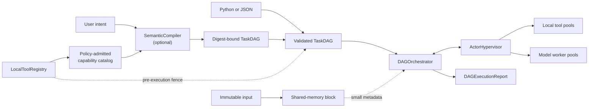

# ThreadSwarm

## In plain English

ThreadSwarm helps one ordinary computer finish complex jobs more predictably by splitting them into small steps and sending each step to the right local worker. Instead of giving every task and the same large input to one oversized AI model, it reuses the input, runs independent work in parallel, and records exactly what succeeded or failed.

**Example:** a team can process a large folder of support messages with separate local steps for cleaning, classification, policy checks, and summary generation. If one classifier fails, ThreadSwarm can retry that step without repeating the whole job.

| Feature | What it means in the real world |
| --- | --- |
| Validated task graph | Work cannot silently run in an impossible order or depend on a missing step. |
| Explicit capability routing | Teams choose which tool or model handles each task instead of accepting an opaque automatic choice. |
| Shared immutable input | Large local data is loaded once, reducing avoidable copying between workers. |
| Process-based parallelism | Independent CPU-heavy steps can make progress at the same time on one machine. |
| Retries and structured reports | Failed work is easier to recover and every run is easier to explain. |

## Technical summary

ThreadSwarm is an embeddable, CPU-first Python runtime that executes a validated task DAG across local worker processes on one machine.

The key idea is simple:

- define small tasks with explicit dependencies and routes
- place one large, immutable input in shared memory instead of every task queue
- execute ready tasks in parallel with local tools or specialized model workers
- correlate every run and retry, then reduce the leaf outputs into a final result

Despite the name, execution workers are **processes**, not threads, so CPU-bound tools can run independently. ThreadSwarm is an explicit, dependency-driven DAG runtime, not a swarm of autonomous agents or a distributed cluster scheduler.

> [!IMPORTANT]
> A `TaskDAG` can be written in Python, loaded from JSON, or produced by the optional `SemanticCompiler`. For autonomous local execution, `CapabilityAwareRuntime` gives the compiler only the policy-admitted live tool catalog, rejects invented or ambiguous routes, and binds the resulting DAG to that catalog before launching it.

## Why

Complex tasks often get pushed into one giant model, which creates three problems:
- hardware cost
- latency
- wasted intelligence for work that could be done by simpler tools

ThreadSwarm takes the opposite approach: decompose work into small steps and route each step explicitly to a CPU-friendly executor. It does not choose the cheapest executor automatically; the DAG supplies the route.

## Architecture



The orchestrator validates and schedules the graph. The hypervisor owns route-specific process pools. Workers attach to shared input, execute one task, and return a correlated result. See [How ThreadSwarm Works](docs/how-it-works.md) for the exact lifecycle, routing, memory, retry, and recovery rules.

The code is split into a few small pieces:
- `threadswarm/`: public package namespace
- `src/config.py`: internal typed runtime configuration for provider/model settings
- `src/cli.py`: internal command line implementation for validation, compilation, and demos
- `src/compiler/`: semantic planning plus capability catalog, policy, and binding gates
- `src/demos/`: packaged runnable demos and sample data
- `src/engine/shared_memory.py`: read-only zero-copy input views for `ndarray`; shared-memory transport for `str` and `bytes`
- `src/engine/actor_pool.py`: process-based execution pool
- `src/engine/orchestrator.py`: dependency-aware DAG execution
- `src/engine/tool_registry.py`: registration of local CPU-friendly tools

## Current Capabilities

What the repo can do today:
- validate DAGs with clear errors for duplicate IDs, missing dependencies, future dependencies, self-dependencies, and cycles
- keep large context out of task queues by reconstructing it from shared memory in worker processes
- route tasks by `tool_name` or `model_type`, rejecting missing or unknown routes before execution in explicit heterogeneous pools
- execute a DAG end-to-end with dependency tracking
- isolate repeated runs with unique run and attempt IDs
- detect worker death and discard the complete hypervisor generation when work may have been abandoned
- block downstream tasks after upstream failures
- reduce leaf task results into a final result
- export structured execution reports for debugging and evals
- validate optional local tool input/output contracts with Pydantic schemas
- retry task failures with explicit per-task retry policies
- mark slow attempts failed with per-task logical timeout policies
- create OpenAI-compatible model worker configs for `model_type` tasks
- run JSON DAG files from the CLI with a built-in deterministic text toolkit
- run file-backed golden eval fixtures for deterministic DAG regressions
- run packaged demos and DAG validation through the `threadswarm` CLI
- configure compiler provider settings through typed environment-backed config
- compile natural-language intent against the exact policy-admitted live tool catalog
- reject missing, invented, ambiguous, side-effecting-by-default, or modality-incompatible routes before worker startup
- fence catalog drift and post-compilation DAG mutation with deterministic SHA-256 digests
- bound prompt, catalog, response, DAG, retry, task-timeout, and whole-run resource budgets in application policy
- start worker processes only for tools selected by the verified execution snapshot
- compile and execute one bound local-tool DAG through the `threadswarm compile-run` CLI

What is still intentionally lightweight:

- provider-specific hosted tool integrations in `src/models/`
- hard cancellation of a single in-flight worker, distributed execution, persistence, and richer scheduling policies

## Task Schema

`SubTask` supports:
- `id`
- `description`
- `instruction`
- `dependencies`
- `payload_hint`
- `modality`
- `tool_name`
- `model_type`
- `retry_count`
- `retry_delay_seconds`
- `timeout_seconds`

Use `tool_name` when a task should run on a local CPU-friendly executor.
Use `model_type` when a specialized worker or model is actually required.

## Execution Model

1. The caller supplies a `TaskDAG`, optionally produced by `SemanticCompiler.compile(...)`.
2. The orchestrator validates the DAG and preflights every route before allocating context or starting workers.
3. When context is supplied, `ContextMemoryManager.load_and_share(...)` copies the large payload once into shared memory.
4. `DAGOrchestrator.run(...)` submits every root task, then unlocks dependents as their direct dependencies finish.
5. In explicit heterogeneous pools, `ActorHypervisor` routes each task to the exact pool named by `tool_name`, otherwise `model_type`. The legacy homogeneous constructor uses its single default pool.
6. Workers receive:
   - the shared payload
   - small results from direct dependencies
   - task metadata like `modality`, `tool_name`, and `model_type`
   - the current execution `attempt`
7. Infrastructure events and results carry unique `run_id` and `attempt_id` keys. Late results from an old run or retry are ignored.
8. The orchestrator reduces leaf outputs and returns a structured `DAGExecutionReport`.

Shared-memory reconstruction has type-specific semantics. NumPy inputs become read-only zero-copy views over the shared block. Text and bytes avoid normal task-queue transfer, but each worker materializes its own Python `str` or `bytes` copy. Dependency results and returned results are still serialized through multiprocessing queues and should remain small.

## Practical Guide

| Read | Use it for |
|---|---|
| [Quickstart](docs/quickstart.md) | Install ThreadSwarm and run the packaged demo |
| [How ThreadSwarm Works](docs/how-it-works.md) | Exact architecture, scheduling, routing, shared memory, retries, and recovery |
| [Local Tool Pipelines](docs/local-tool-pipelines.md) | Build and register your own tools and DAGs |
| [Configuration](docs/configuration.md) | Environment-backed compiler and worker defaults |
| [Product Strategy](docs/product-strategy.md) | Positioning, trade-offs, and capability roadmap |
| [Run Isolation RFC](docs/rfcs/0001-run-isolation-and-pool-recovery.md) | Rationale behind run fencing and pool recovery |
| [Capability Binding RFC](docs/rfcs/0002-capability-bound-compilation.md) | Trust boundary, policy, prompt projection, and digest fences |

## Repository Structure

```text
docs/
  quickstart.md             Fast path from install to runnable demo
  how-it-works.md           Precise runtime architecture and lifecycle
  local-tool-pipelines.md   Practical guide for local tool DAGs
  configuration.md          Environment-backed settings
  product-strategy.md       Positioning and roadmap
  rfcs/                     RFC folder for architectural proposals
evals/
  golden/                   Deterministic JSON eval fixtures
examples/
  incident_triage.py        Compatibility wrapper for the packaged demo
src/
  cli.py                    `threadswarm` command line interface
  config.py                 Typed runtime configuration
  compiler/                 Semantic compiler and DAG schema
  demos/                    Packaged demos and sample data
  engine/                   Shared memory, actor pool, orchestrator, tool registry
  models/                   Optional model adapters, including OpenAI-compatible workers
  tools/                    Built-in local toolkits
threadswarm/                Public import namespace wrapping the runtime
tests/                      Compiler and engine tests
```

## Constraints

- CPU-first execution
- `multiprocessing`, not threads, for inference/execution workers
- one active orchestrated run per `ActorHypervisor`; use separate hypervisors for concurrent DAG runs
- one machine only; no remote worker discovery or distributed queue
- large immutable input context should use shared memory; dependency results still cross queues and should remain small
- Windows-compatible picklable worker hooks

## Install

Requirements:
- Python 3.10+

Dependencies live in:
- `requirements.txt`
- `pyproject.toml`

Typical setup:

```bash
python -m venv .venv
source .venv/bin/activate
python -m pip install --upgrade pip
python -m pip install -e ".[dev]"
```

Typical test run:

```bash
pytest -q
```

Run the packaged demo:

```bash
threadswarm demo incident-triage
```

Export a full execution report:

```bash
threadswarm demo incident-triage --json --report-file reports/incident.json
```

Validate a DAG JSON file:

```bash
threadswarm validate-dag path/to/dag.json
```

Run a DAG JSON file with the built-in text toolkit:

```bash
threadswarm run-dag path/to/dag.json --payload "hello local dag" --json
```

Compile intent against that toolkit and execute only the bound plan:

```bash
threadswarm compile-run "Normalize the input, then count its words" \
  --payload "hello local dag" \
  --json \
  --plan-file reports/bound-plan.json \
  --report-file reports/compile-run.json
```

`compile-run` needs the configured OpenAI-compatible compiler provider. The model
only proposes a DAG; registry policy, route validation, and both integrity fences
remain deterministic application code. The whole run defaults to a 300-second
budget and may be raised only as far as the application policy allows. When
execution starts but fails, requested plan and report files are still written.

Run deterministic golden eval fixtures:

```bash
threadswarm eval-golden evals/golden --json
```

Compiler provider settings can be supplied through environment variables documented in `.env.example`:

```bash
THREADSWARM_LLM_BASE_URL=http://localhost:11434/v1
THREADSWARM_LLM_MODEL=llama3.2
THREADSWARM_LLM_TIMEOUT=60
```

## Contribution Notes

- Keep planning concerns in `src/compiler`
- Keep execution concerns in `src/engine`
- Keep machine/provider variation in `src/config.py` and `.env.example`
- Keep runtime behavior observable through structured execution reports
- Keep local tools narrow and contract-backed when their outputs feed downstream tasks
- Use task retry policies only for idempotent or safe-to-repeat work
- Use task timeout policies for tools that can stall; keep deadlines above normal process startup and queue latency
- Prefer local tools when they can solve the task well
- Keep built-in toolkits small, deterministic, and easy to test
- Add model-backed executors only where they materially improve outcomes
- Write RFCs in `docs/rfcs/` for meaningful architectural changes

## Status

The local DAG execution runtime is implemented, packaged, CLI-accessible, and covered by tests. Capability-aware compile-and-run is now implemented for registered local tools: the compiler sees a compact policy-admitted catalog, while deterministic code rejects unsafe routes and verifies catalog and plan digests immediately before execution. Model-worker catalog binding, MCP discovery, persistence, and distributed execution remain future integration layers rather than implicit fallbacks.

## License

Licensed under the [Apache License 2.0](LICENSE).
