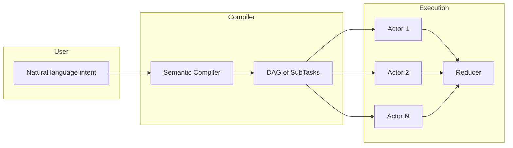
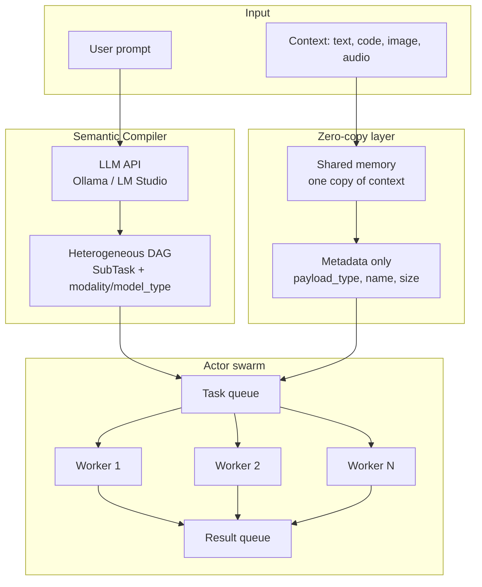
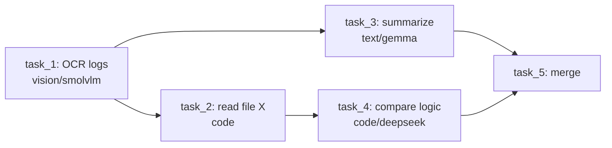
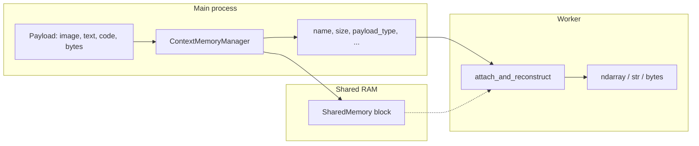
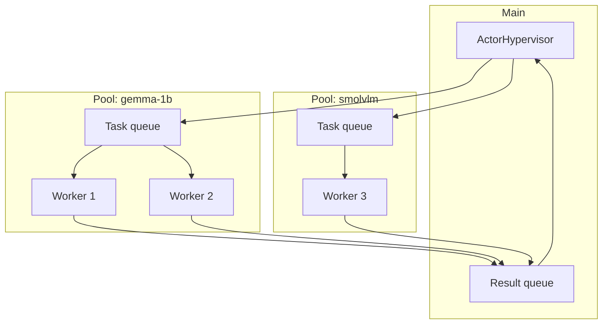

# ThreadSwarm

**Distributed multimodal AI on CPUs** — Natural-language intent is compiled into a heterogeneous DAG of micro-tasks and executed by a swarm of small models (text, code, vision, audio) on local CPUs, using zero-copy shared memory and the Actor model. No GPUs required.

---

## Manifesto: The Era of the Semantic Compiler and Distributed Multimodal AI on CPUs

### The problem: the illusion of the monolithic model

When we want an AI to analyze a massive codebase, a 100-page report, or an hour-long video, the industry relies on a single giant model. That leads to:

- **Unsustainable hardware costs** — Enormous models need expensive GPU clusters; AI stays out of reach for local or edge deployment.
- **Intrinsic slowness** — One model processes the entire request sequentially, limited by memory bandwidth.
- **Cognitive waste** — Using a 70B model to extract a date from an invoice, summarize a log, or recognize a color is like using a supercomputer for 2+2.

We need to stop treating AI as an omniscient oracle and start treating it as a **distributed operating system** — the paradigm of **Software 3.0**.

### The solution: Semantic Compiler + actor swarm

1. **Semantic Compiler** — A lightweight LLM takes the user’s *intent* in natural language (e.g. “Analyze this codebase and the attached logs, then find the bug”) and produces a **Directed Acyclic Graph (DAG)** of microscopic sub-tasks. It does not do the heavy lifting; it *plans* execution. Each task can specify **modality** (text, code, vision, audio) and optional **model type** (e.g. Gemma-1B for text, DeepSeek-R1 for logic, SmolVLM for vision).
2. **Actor swarm** — Small models run as **independent processes** on CPU cores. Each actor gets a micro-task and a **pointer to shared memory** (zero-copy: one copy of the context in RAM). They work in parallel; a reducer merges results into the final answer.

So: **one compiler plans, many small models execute**. Heterogeneous workloads (text, code, images, audio) are supported; no single giant model; no GPUs if you have enough RAM and CPU cores.

### High-level flow



---

## Architecture overview



- **Compiler**: intent → heterogeneous DAG (modality/model_type per task); no context data on the wire.
- **Shared memory**: context (text, code, image, audio, bytes) lives once in RAM; workers get only metadata and attach to the same block.
- **Workers**: each process takes a task + context_metadata, reconstructs payload (ndarray/str/bytes), runs inference, pushes a result.

---

## Current implementation

What exists today: the **core engine** (compiler + context memory + heterogeneous actor pool). Model adapters (load Gemma, DeepSeek-R1, SmolVLM in workers) are left to you or future modules in `src/models/`.

### 1. Semantic Compiler (`src/compiler/`)

- **Role**: Turn a **multimodal** user prompt into a **heterogeneous DAG** of SubTasks (no execution, only planning).
- **How**: Calls an OpenAI-compatible API (e.g. **Ollama**). System prompt asks for a JSON array of tasks with `modality` (text, code, vision, audio, multimodal) and optional `model_type` (e.g. gemma-1b, deepseek-r1-1.5b, smolvlm) for actor selection.
- **Output**: `TaskDAG` — ordered list of `SubTask`: `id`, `description`, `instruction`, `dependencies`, `payload_hint`, `modality`, `model_type`.

**Example DAG** (heterogeneous):



**Code**: `SemanticCompiler.compile(prompt)` → `TaskDAG`. Each `SubTask` has `instruction`, `dependencies`, `modality`, `model_type` so the orchestrator can route tasks to the right actor pool.

---

### 2. Zero-copy shared memory (`src/engine/shared_memory.py`)

- **Role**: Store **any large context** (image, text, code, audio buffer, binary blob) **once** in RAM; workers receive only **metadata** and attach to the same block. No copying buffers between processes; **no pickle for context payloads**.
- **How**:
  - **ContextMemoryManager**: `load_and_share(payload)` accepts `np.ndarray`, `str`, or `bytes`. Allocates `multiprocessing.shared_memory.SharedMemory`, copies payload in, returns metadata: `name`, `size`, `payload_type` (ndarray | text | bytes), and type-specific fields (e.g. `shape`, `dtype` for ndarray; `encoding` for text).
  - **attach_and_reconstruct(metadata)**: in each worker, attaches to the same block and returns `(shm, payload)` where payload is an ndarray view (zero-copy), decoded str, or bytes. Worker must keep `shm` and close it when done.
  - **VisionMemoryManager** is a backward-compat alias for ContextMemoryManager.

**Data flow**:



Only the small metadata dict goes over the task queue; the context stays in one place.

---

### 3. Actor swarm (`src/engine/actor_pool.py`)

- **Role**: Run **heterogeneous** worker pools: each pool is keyed by **model_type** (e.g. gemma-1b, smolvlm) and has its own task queue and **inference hook**. Tasks carry `context_metadata` (from ContextMemoryManager); workers reconstruct the payload and run the hook. Single shared result queue.
- **How**:
  - **ActorHypervisor**: either one homogeneous pool `(num_workers, run_inference_hook)` or **worker_configs**: list of `{model_type, num_workers, run_inference_hook}`. Each config gets its own task queue and N processes; all push to one result queue.
  - **Task payload**: `task_id`, `instruction`, optional `context_metadata`, `modality`, `model_type`. Routing: `submit(task)` sends to the pool whose `model_type` matches `task["model_type"]` (or default).
  - **run_inference_hook(context, instruction, task_id, modality, model_type)**: worker calls with reconstructed payload (ndarray/str/bytes or None). Must be **picklable** (e.g. module-level) on Windows.
  - **Shutdown**: one sentinel per worker, then join. No threading for inference — only processes.

**Process layout** (heterogeneous):



---

## End-to-end (idea vs current code)

| Step | Idea | Current implementation |
|------|------|-------------------------|
| 1. Intent → plan | Semantic Compiler produces heterogeneous DAG | `SemanticCompiler` → `TaskDAG` with `SubTask.modality` and `SubTask.model_type` |
| 2. Context in RAM once | Zero-copy shared memory for any payload | `ContextMemoryManager.load_and_share()` (ndarray/text/bytes) + workers use `attach_and_reconstruct(metadata)` |
| 3. Run sub-tasks in parallel | Heterogeneous actor swarm | `ActorHypervisor` with optional `worker_configs`; tasks carry `context_metadata`; routing by `model_type` |
| 4. Merge results | Reducer / aggregator | Not implemented; you consume `result_queue` and merge by `task_id` / DAG dependencies |

So: **compiler**, **shared memory**, and **actor pool** are implemented and wired; **scheduler** (which tasks to send when, respecting DAG) and **reducer** (merge results into one answer) are the next layer you can add on top.

---

## Repository structure

```
docs/rfcs/       — RFCs for architectural changes
src/compiler/    — Semantic Compiler (intent → DAG, LLM API, Pydantic)
src/engine/      — Shared memory manager, actor pool, worker loop
src/models/      — (Reserved) model adapters (e.g. load SmolVLM in workers)
tests/           — Tests for compiler and engine
```

---

## Constraints

- **No threading for AI inference** — use `multiprocessing` only (GIL).
- **No pickle / standard IPC queues for large context payloads** — only shared memory + metadata on queues (text, code, images, audio, etc.).
- **Windows**: `run_inference_hook` must be picklable (e.g. module-level function).

---

## Engineering & contribution guidelines

- **RFC process**: New architectural features require an RFC in `docs/rfcs/` (why, impact on CPU/memory) before code; code is accepted after human approval of the design.
- **Spec-driven development**: Specs of the async engine are living documents; AI and human contributors must follow the Semantic Compiler / ContextMemoryManager / Actor swarm boundaries.
- Use **type hints** and **Pydantic** for public APIs and task schemas.
- Keep **src/compiler** for intent → DAG, **src/engine** for execution, **src/models** for model loaders.
- Core engine: **no placeholders or mocks**; contributions should be production-ready.

---

## Requirements

- Python 3.10+
- See `requirements.txt` or `pyproject.toml` for dependencies (numpy, opencv-python-headless, pydantic, httpx; pytest for dev).

---

## License

Open source; see repository license file.
