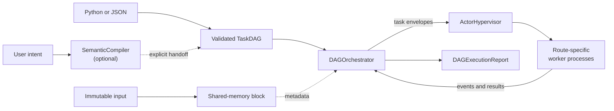
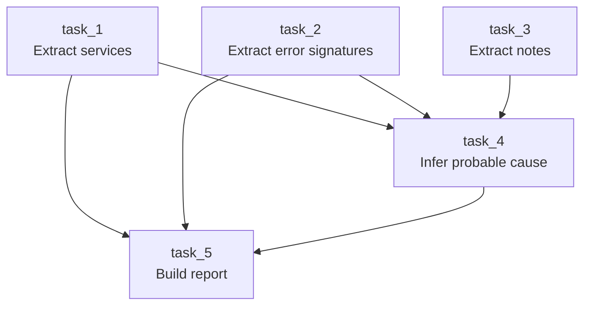
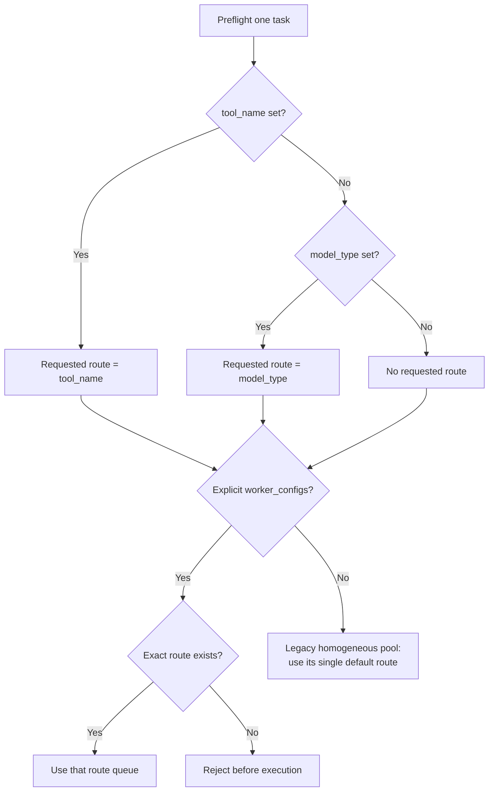
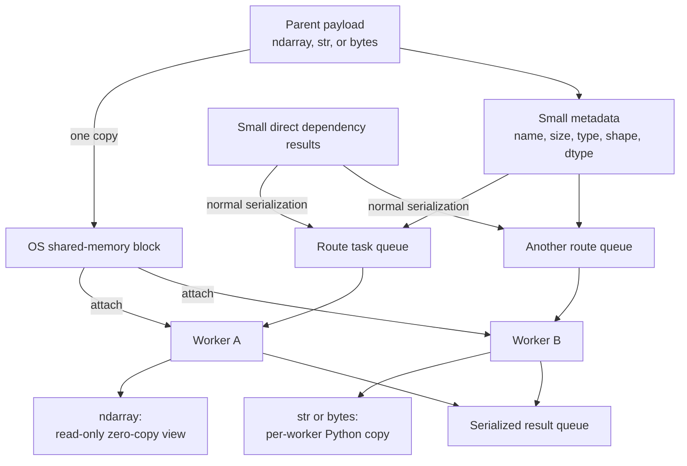
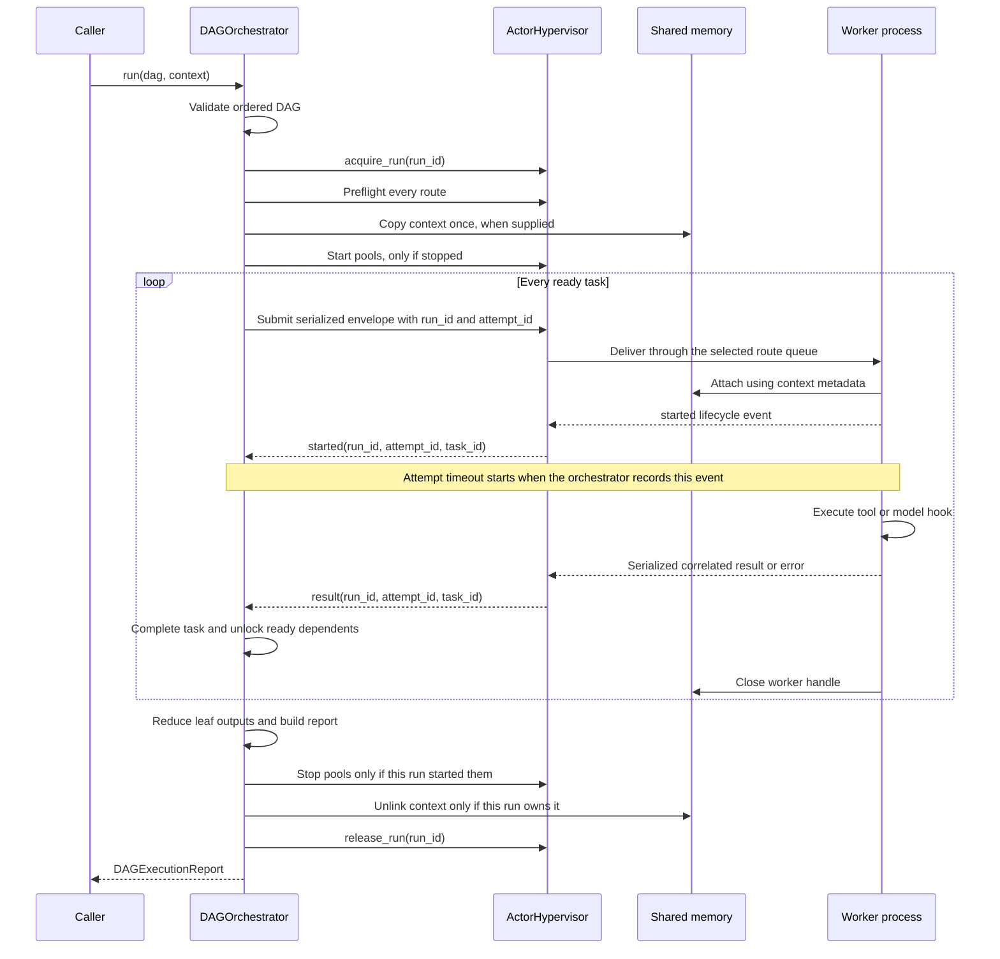
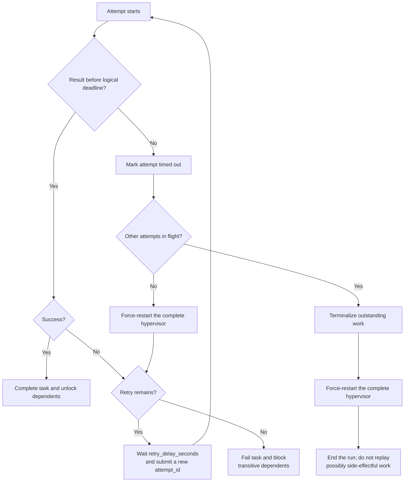

# How ThreadSwarm Works

ThreadSwarm is a single-machine Python runtime for executing a dependency graph with local worker processes. It keeps one large, immutable input outside normal task queues, routes each task to an explicitly named worker pool, and returns a structured report of the run.

Despite the name, the execution workers are **processes**, not threads. ThreadSwarm is also not an autonomous-agent swarm: the graph, routes, and retry policies are explicit and inspectable.

> [!IMPORTANT]
> The execution runtime begins with a `TaskDAG`. You can write that DAG in Python, load it from JSON, or produce it with the optional `SemanticCompiler`. The compiler and executor are separate today: the compiler does not inspect the registered tools, bind routes, or call the orchestrator for you.

## The One-Minute Model

In plain language:

1. Supply an ordered graph of small tasks.
2. Validate the graph and every requested route before execution.
3. Copy the large input once into shared memory.
4. Submit all tasks whose dependencies are complete.
5. Workers attach to the shared input and run the explicitly selected tool or model adapter.
6. Correlate results, unlock dependents, reduce the leaf outputs, and clean up owned resources.

## Core Terms

| Term | Simple meaning |
|---|---|
| `SubTask` | One unit of work, its dependencies, route, and reliability policy |
| `TaskDAG` | An ordered list of `SubTask` objects with no cycles |
| Route | The exact worker-pool label selected by `tool_name`, otherwise `model_type` |
| Local tool | A normal Python callable registered under a stable `tool_name` |
| Model worker | A callable or adapter registered under a `model_type` route |
| Worker process | A child process that reads one route queue and executes its callable |
| `ActorHypervisor` | Owns route queues, worker processes, lifecycle events, and results |
| `DAGOrchestrator` | Validates, schedules, retries, correlates, reduces, and reports one DAG run |
| Shared context | The one large input payload published through OS shared memory |
| `dependency_results` | Small serialized outputs from a task's direct dependencies |

## 1. Produce A TaskDAG

There are three input paths:

- construct `TaskDAG` and `SubTask` objects directly in Python
- load a JSON DAG with the CLI or `parse_task_dag_json(...)`
- call `SemanticCompiler.compile(...)`, then explicitly pass its result to the runtime

The semantic compiler synchronously calls an OpenAI-compatible `/chat/completions` endpoint, parses the first answer as JSON, and validates the resulting DAG. It is a planning helper, not part of the execution loop.

The most predictable path is to start with a hand-written DAG and stable route names. Once the tools and tests are solid, the same names can be exposed to a compiler or another planner.

### What DAG validation guarantees

Before acquiring shared memory or starting worker processes, ThreadSwarm rejects:

- duplicate task IDs
- duplicate dependencies on one task
- missing dependencies
- self-dependencies
- dependency cycles
- dependencies that appear at or after the dependent task in the list

The final rule means a `TaskDAG` is an **ordered DAG**. ThreadSwarm validates the order; it does not topologically sort arbitrary input.

`modality` is descriptive metadata passed to the worker. It does not choose a route, and the schema currently accepts any string even though the compiler recommends `text`, `code`, `vision`, `audio`, or `multimodal`.

## 2. Understand Fork And Join Scheduling

The packaged incident-triage demo has five tasks:

`task_1`, `task_2`, and `task_3` are roots, so the orchestrator submits all three immediately. Their completion order is nondeterministic. `task_4` becomes ready only after all three complete. `task_5` waits for `task_1`, `task_2`, and `task_4`.

Each task receives results from its **direct** dependencies only. For example, `task_5` receives the outputs of `task_1`, `task_2`, and `task_4`; it does not receive `task_3` separately because `task_3` is only a transitive dependency.

The report's `execution_order` records the order in which the orchestrator accepts successful results. It is not a promise that parallel tasks will always appear in the same order.

## 3. Route Every Task Explicitly

Routing is label-based; there is no automatic cost or capability scheduler.

The effective route is:

1. `tool_name`, when present
2. otherwise `model_type`
3. otherwise no requested route

If both fields are set, `tool_name` wins. Setting exactly one is clearer.

`LocalToolRegistry.create_hypervisor()` creates an explicit route for every registered tool. Each route gets its own task queue and configured number of worker processes. Explicit heterogeneous pools fail closed: a missing or unknown route raises `UnknownRouteError` during preflight, before shared context is allocated or work is submitted.

The older homogeneous constructor, `ActorHypervisor(num_workers=..., run_inference_hook=...)`, intentionally remains backward compatible. It uses one generic pool and ignores task route hints for queue selection, although the selected hint is still passed to the hook.

Tool contract schemas can validate input and output inside the worker. `risk_class`, `side_effect_class`, and declared `modalities` are currently descriptive metadata; the scheduler does not enforce policy from them.

## 4. Move Large Input Through Shared Memory

Multiprocessing queues serialize their contents. Sending the same large image, array, document, or binary blob with every task would repeatedly copy it. ThreadSwarm instead sends small metadata that tells each worker how to attach to one shared block.

The exact semantics depend on the payload type:

| Input type | Parent publication | Worker reconstruction |
|---|---|---|
| NumPy `ndarray` | Converted to contiguous storage and copied once into the block | Read-only NumPy view over the block; zero-copy at attachment time |
| `str` | UTF-8 bytes copied once into the block | Decoded into a new Python string in each worker |
| `bytes` and bytes-like input | Copied once into the block | Copied into a new Python `bytes` object in each worker |

The NumPy `writeable=False` flag prevents normal writes through the reconstructed array, but this is not OS-level immutable memory. Object-dtype arrays are rejected because their pointers are not safe to share this way.

Only the main input uses this transport. Task envelopes, direct `dependency_results`, lifecycle events, errors, and returned results are serialized through queues. Keep intermediate results small. Returning a NumPy array produces a detached serialized result; it does not remain a zero-copy shared view.

### Who owns the shared block?

| Call form | Owner | Cleanup rule |
|---|---|---|
| `run(dag, context=value)` | Orchestrator | Creates the block and closes/unlinks it after the run; any required pool shutdown or recovery happens first |
| `run(dag, context_metadata=metadata)` | Caller | Caller keeps the block alive for the whole run and cleans it up afterward |
| Neither argument | No shared block | Workers receive `payload=None` |

Supplying both `context` and `context_metadata` is an error. One `ContextMemoryManager` owns at most one block; publishing another payload through that manager closes and unlinks its previous block.

## 5. Follow One Run End To End

The ordering details matter:

1. DAG validation happens before the run lock is acquired.
2. The hypervisor is exclusively bound to a new `run_id`.
3. Every task route is checked before shared-memory allocation or process startup.
4. Root tasks are submitted in task-list order, but may finish in any order.
5. A worker attaches to context before emitting `started`.
6. Successful completion decrements each dependent's remaining prerequisite count.
7. Leaf results are reduced only after every task record is terminal.
8. Pool and shared-memory cleanup happen before the run lock is released.

If the hypervisor was already running, a normal run leaves it running. If the orchestrator started it, a normal run shuts it down. Only one orchestrated run can own a hypervisor at a time; use separate hypervisor instances for truly concurrent DAG runs.

## 6. Correlate Runs, Retries, And Late Results

Every DAG execution gets a unique `run_id`. Every submission—including a retry—gets a unique `attempt_id` and an incrementing numeric `attempt`.

The infrastructure accepts a worker result only when all of these match the active state:

- `run_id`
- active `attempt_id`
- `task_id`

Late results from an older run or superseded attempt are ignored. Tool hooks receive the numeric `attempt` in their context, while `run_id` and `attempt_id` remain infrastructure and report correlation fields.

Every successful pool start also increments a generation number. The orchestrator snapshots it for the run. If the generation changes unexpectedly while work is active, the run becomes terminal instead of waiting forever on queues that were replaced.

## 7. Handle Failure, Retry, And Timeout

A worker-hook exception becomes a correlated task error. `retry_count` means “retry any task error this many times”; ThreadSwarm does not classify errors as transient. Only retry work that is idempotent or protected by an idempotency key.

There are two timeout levels:

- `SubTask.timeout_seconds` limits one attempt. Its deadline starts only when the orchestrator receives the worker's `started` acknowledgement, so queue waiting and context attachment do not consume it.
- `DAGOrchestrator.run(..., timeout=...)` measures elapsed time from just before run acquisition, after DAG validation. Route preflight, context publication, pool startup, and queue waiting consume the budget; the limit is enforced once the execution loop is running.

A per-task timeout is logical; ThreadSwarm cannot safely kill only that task. It force-restarts the **entire hypervisor**, including every route pool. When no unrelated attempt is active, a configured retry can continue in the fresh generation. When other attempts are active, the run ends instead of replaying work that may already have caused side effects.

An unexpected worker death or unexpected pool-generation change also terminalizes active work and triggers recovery. Recovery preserves pool ownership:

| Pool state before `run()` | Normal completion | Recovery required |
|---|---|---|
| Stopped | Started for the run, then stopped | Force-stopped; final state is stopped |
| Prestarted | Left running | Recreated in a fresh generation and left running |

With the default `fail_fast=True`, retries are exhausted first. A terminal task failure then blocks its transitive dependents, terminalizes pending or running independent work, and raises `DAGExecutionError` with a report. Active workers cause generation recovery. With `fail_fast=False`, independent branches may finish and the report is returned instead. The concurrent-timeout case remains terminal because selective cancellation is not implemented.

## 8. Reduce Outputs And Inspect The Report

The default reducer looks for leaf tasks—tasks that no other task depends on:

- one leaf: return that leaf's result directly
- multiple leaves: return `{leaf_task_id: result}`
- no leaves, as with an empty DAG: return `None`

You can provide a custom reducer to `DAGOrchestrator` when the final shape should be different.

A completed run returns a `DAGExecutionReport`, and execution-phase `DAGExecutionError` exceptions carry one. Validation, concurrent acquisition, route-preflight, context-publication, or pool-start errors can happen before a report exists. A report records:

- run ID, start/end times, duration, and optional stop reason
- completed, failed, and blocked task counts
- successful completion order and leaf task IDs
- task status, route metadata, dependencies, attempts, and timeout details
- attempt IDs and accumulated attempt errors
- task results and optional direct dependency results
- the reduced final result

Use `report.to_dict()` for a JSON-friendly trace. Large scientific values are converted to JSON-safe representations; include dependency results or context metadata only when needed.

## 9. Know The Boundaries

ThreadSwarm currently guarantees a narrow execution model:

- one machine
- one active DAG run per hypervisor
- process-based workers with fixed route pools
- explicit label routing, not automatic executor selection
- one immutable shared input per run
- in-memory scheduling and reports, not durable queues or persistence
- whole-hypervisor recovery, not selective hard cancellation
- module-level, picklable worker callables for Windows compatibility

These boundaries make the runtime small, testable, and suitable for local CPU-first pipelines. They also mean it is not a replacement for a distributed workflow engine, a durable job system, or an autonomous multi-agent framework.

## Code Map

| Concern | Implementation |
|---|---|
| DAG schema, validation, optional compiler | `src/compiler/parser.py` |
| Shared-memory publication and attachment | `src/engine/shared_memory.py` |
| Process pools, queues, routing, lifecycle | `src/engine/actor_pool.py` |
| DAG scheduling, correlation, recovery, reports | `src/engine/orchestrator.py` |
| Local tool registration and contracts | `src/engine/tool_registry.py` |
| OpenAI-compatible model adapter | `src/models/openai_compatible.py` |
| Runnable fork/join example | `src/demos/incident_triage.py` |

## Related Documentation

- [README](../README.md) — project overview and install commands
- [Quickstart](quickstart.md) — run the packaged demo
- [Local Tool Pipelines](local-tool-pipelines.md) — build your own tools and DAGs
- [Configuration](configuration.md) — environment-backed settings
- [Run Isolation And Pool Recovery RFC](rfcs/0001-run-isolation-and-pool-recovery.md) — design rationale
- [Product Strategy](product-strategy.md) — current positioning and roadmap
